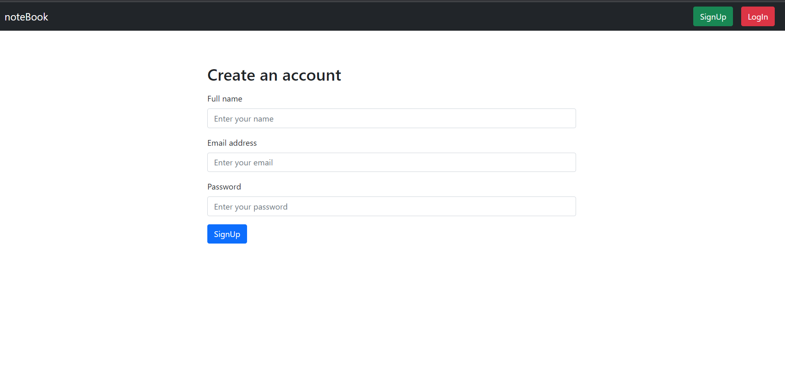
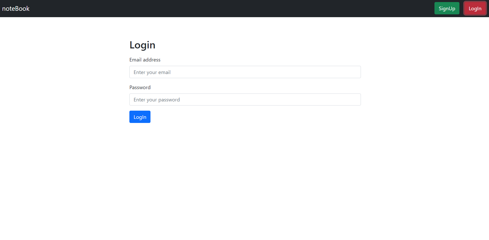
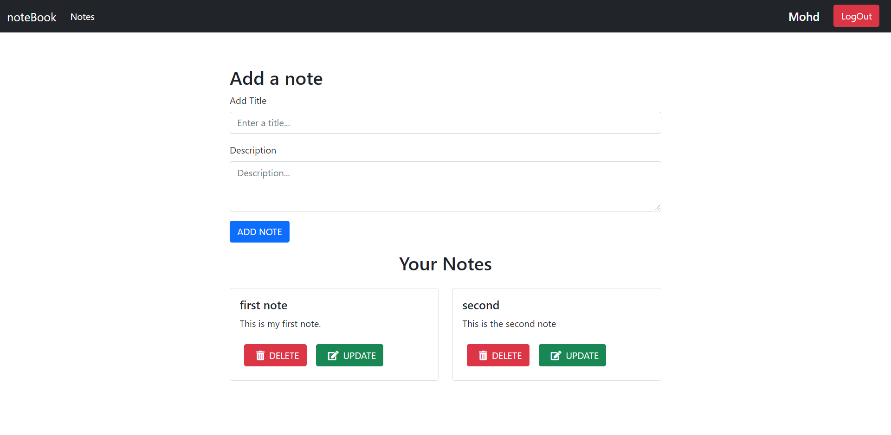
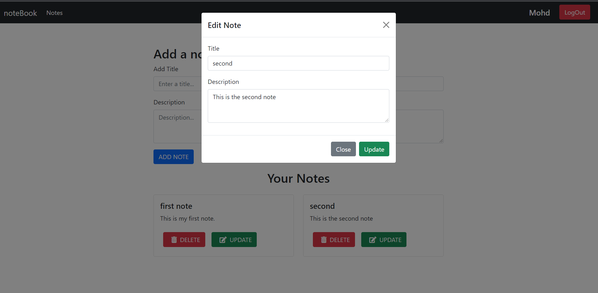

# Notes App

[](https://travis-ci.org/joemccann/dillinger)

This is an individual project. In this app, users can add, update and delete only their notes after creating an account.

**To see the live site click the below link** 👉🏼 https://note-app-neon.vercel.app

## Installing and Running

Executing the commands mentioned below one by one in your command line will help in making this NodeJs App.
**Cloning**

```
git clone https://github.com/sheikhtausif/notes_app.git
cd ./notes_app
cd ./client
npm install
cd ./server
npm install
```

**To run the nodejs app execute below command**

```
cd ./client
npm run both
```

## Built with
<ul>
  <li>React Js</li>
  <li>Node Js</li>
  <li>HTML</li>
  <li>CSS</li>
  <li>JavaScript</li>
  <li>Mongo DB Atlas</li>
</ul>

## Used libraries
  <h3>Front-end</h3>
<ul>
  <li>node modules</li>
  <li>axios</li>
  <li>React Js</li>
  <li>Bootstrap</li>
  <li>React-router-dom</li>
</ul>

  <h3>Back-end</h3>
<ul>
  <li>node modules</li>
  <li>express</li>
  <li>mongoose</li>
  <li>cors</li>
  <li>bcryptjs</li>
  <li>jsonwebtoken</li>
  <li>express-validator</li>
</ul>

## Features
<ul>
  <li>Signup</li>
  <li>Signin</li>
  <li>Add Notes</li>
</ul>

  
## Some Screenshots of the App
<p>Users can create an account</p>

<br/>
<p>Users can login in their account</p>

<br/>
<p>Users can see their notes</p>

<br/>
<p>Users can update their notes</p>

